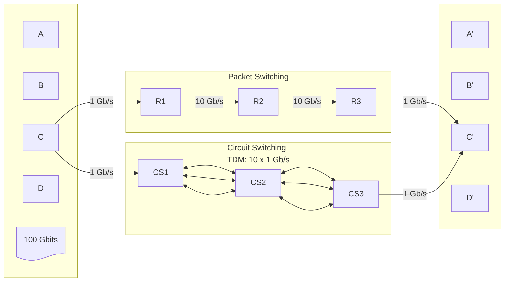

## Switching <!-- omit in toc -->

# Exercise Switching Techniques

*Academic year 2024-2025*  
*Telematics Engineering Department - Universidad Carlos III de Madrid*

---

We want to compare the performance of two switching technologies in
as-fair-aspossible conditions. To this end, we build the network set up of the
Figure. Each of the end-systems A, B, C, D needs to send concurrently a 100Gbit
file to endsystems A', B', C', D' respectively. For this purpose, they have two
1Gb/s line cards (connected to point-to-point dedicated links), each of them
interfacing a different type of network technology: a Packet Switching network
(in the middle) and a Circuit Switching network (bottom). For the sake of
simplicity, the Figure only shows the links of end systems C and C'.

We'd like to make a simple comparison of the two technologies by analyzing the
file transfer time when all use the same technology at the same time.

Assumptions:

* There is no other traffic in the network.
* BER=0 (bit error rate) in the links.
* Propagation delay=0 (remember that normally it is 5microsec/Km in a fiber).
* No protocol overhead at all. Only file bytes are sent in all cases, not
  headers.
* Switching time=0 in switches (remember that normally this time is a few
  microsecs). That is, in this exercise we only consider queuing delay (when
  there is such delay) and transmission delay.
* For PS:
    * Assume packets of size 10000 bits, sent back-to-back (i.e. no gap between
      them), infinite buffers, and packets are served in roundrobin fashion.
      This means that if packets A,B,C,D arrive simultaneously at the input
      ports of a router destined to the same output port, then the router would
      write the packets to the output buffer in this order: A,B,C,D,A,B,C,..
* For CS:
    * Assume that the switches are connected by a 10Gb/s link, which is
      channelised into 10 x 1Gb/s-TDM channels. The switching unit is 1 BYTE. In
      other words, the bytes from the ten channels are sent like this:
      B1,B2,B3,B4,B5,B6,B7,B8,B9,B10,B1,B2,B3,… and there isn't any additional
      framing overhead (no control bytes, OAM bytes, frame alignment sequence,
      checksum, etc). Questions:

## Question 1) •
**In the worst case** for the end system D (i.e. D is always the last to be
served in the round robin, etc), how long would it take each technology to
transfer the **whole file for D**?

> **Answer**
>
> In Packet Switching, the bandwidth between routers should be divided fairly
> between the four end systems, wich would be all transmitting at the same time.
> The bandwidth available for each end system would be
>
> $$
> \frac{10 Gb/s}{4} = 2.5 Gb/s
> $$
>
> Since this is greater than the links between the end systems and the routers,
> those links would be the bottleneck, and the routers would forward packets as
> they arrive. The effective bandwidth for each end system would be the same and
> equal to $1 Gb/s$. The time to transfer the file for D would be
>
> $$
> \frac{100 Gb}{1 Gb/s} = 100 s
> $$
>
> If all 4 systems transmit the last byte at the same time, in this worst case
> scenario the packet from system D would be the last in the queue at the first
> router, so it would be the last to be sent over the first 10Gbps link. All
> packets would be forwarded as soon as they arrive at the next router, and so on
> until the last router, at which the packets would queue up again due to the
> slower 1Gbps link. They would be sent out in the same order as they arrived,
> which would be the order in which they were sent by the first router. So, the
> packet from end system D would be delayed by 3 packet transmission times at
> end-link speed:
>
> $$
> T_{tx;D|PS} = \frac{100Gb}{1Gb/s} + 3 ⋅ \frac{10000b}{1Gb/s} = 100 s + 30 μs
> $$
>
> **The total time to transfer the file for D with Packet Switching would be 100
> seconds and 30 microseconds.**  
>
> In Circuit Switching, there are 10 channels of 1Gbps each. In the worst case
> scenario, end system D would be the last of the 4 end systems to be served. The
> transmission time would simply be the time to transmit the file over a 1Gbps
> link:
>
> $$
> \frac{100 Gb}{1 Gb/s} = 100 s
> $$
>
> And the transmission would be delayed by 3 byte transmission times at 1 Gbps:
>
> $$
> T_{tx;D|CS} = \frac{100Gb}{1Gb/s} + 3 ⋅ \frac{8b}{1Gb/s} = 100 s + 24 ns
> $$
>
> **The total time to transfer the file for D with Circuit Switching would be
> 100 seconds and 24 nanoseconds.**

## Question 2) •
Which technology would deliver the first byte of the file first? Give an
estimation of latency for that byte, in the worst case for D, for each
technology.

> **Answer**
>
> In Packet switching, assuming the worst case scenario for end system D, the
> packet from D would be the last to be sent over the first 10Gbps link and the
> last to arrive at the last router. The first byte of the file would be delayed
> by 3 packet transmission times at 1 Gbps:
>
> $$
> 3 ⋅ \frac{10000b}{1Gb/s} = 30 μs
> $$
>
> In Circuit Switching, the first byte of the file would be delayed by 3 byte
> transmission times at 1 Gbps:
>
> $$
> 3 ⋅ \frac{8b}{1Gb/s} = 24 ns
> $$
>
> So in this case, the Circuit Switching technology would deliver the first byte
> of the file first.

## Question 3) •
Now imagine that instead of a file, the data corresponds to a live
videoconference. Do you think that the latency estimated in question 2 is low
enough in the two technologies? Which one is the best?

> **Answer**
>
> The latencies estimated in question 2 (30 μs for Packet Switching and 24 ns for
> Circuit Switching) are very low, and would be more than enough for a live
> videoconference. The latency in Circuit Switching is lower, so it would be the
> best technology for a live videoconference, but 30 μs is already completely
> unnoticeable for a human observer.

## Question 4) •
Now imagine there are N=20 end-systems on each side of the picture sending one
file each. How many simultaneous file transfers can be supported by the CS
network?

> **Answer**
>
> In the Circuit Switching network, there only 10 channels. This division is
> inflexible, so only 10 simultaneous file transfers could be supported by the
> CS network. The other 10 end systems would have to wait for a channel to
> become available before they can even start sending their files.

## Question 5) •
Same assumption as 4). How many simultaneous file transfers could be supported
by the PS network?

> **Answer**
>
> The Packet Switching network can serve virtually any number of simultaneous
> file transfers, specially considering the infinite buffers. However, the
> bandwidth would be divided between all the end systems, so the effective
> bandwidth for each end system would decrease as the number of simultaneous
> file transfers increases. In this case, with 20 simultaneous file transfers,
> the effective bandwidth for each end system would be $\frac{10 Gbps}{20} = 0.5
> Gbps$
