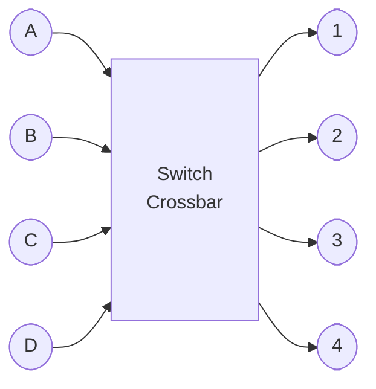

## Switching <!-- omit in toc -->

# Packet Switching Exercises

*Academic year 2024-2025*  
*Telematics Engineering Department - Universidad Carlos III de Madrid*

---

## Exercise 1

A router has 3 inputs (In1, In2, In3) and 3 outputs (OutA, OutB, OutC). VOQ is
used in input lines to route input packets to their outputs. Let’s suppose the
following data flows in input lines:

* In1: Flow1 to OutA and Flow2 to OutC
* In2: Flow3 to OutB and Flow4 to OutC
* In3: Flow5 to OutA

Flows have the same packet size and their rate is the same.

### Question 1

What are the possible connection patterns that can occur if is used PIM
algorithm?

> **Answer**
>
> ```mermaid
> flowchart LR
> subgraph step1 [Step 1: Request]
>     direction LR
>     ri1([in1]) --> roA([OutA]) & roC([OutC])
>     ri2([in2]) --> roB([OutB]) & roC
>     ri3([in3]) --> roA
> end
>
> subgraph step2 [Step 2: Grant]
>
>     subgraph State1
>         direction RL
>         s1oA([OutA]) & s1oB([OutB]) & s1oC([OutC]) ~~~
>         s1i1([in1])  & s1i2([in2])  & s1i3([in3]); s1i1 ~~~ s1oA
>         s1oA --> s1i1
>         s1oB --> s1i2
>         s1oC --> s1i1
>     end
>
>     subgraph State2
>         direction RL
>         s2oA([OutA]) & s2oB([OutB]) & s2oC([OutC]) ~~~
>         s2i1([in1])  & s2i2([in2])  & s2i3([in3]); s2i1 ~~~ s2oA
>         s2oA --> s2i1
>         s2oB --> s2i2
>         s2oC --> s2i2
>     end
>
>     subgraph State3
>         direction RL
>         s3oA([OutA]) & s3oB([OutB]) & s3oC([OutC]) ~~~
>         s3i1([in1])  & s3i2([in2])  & s3i3([in3]); s3i1 ~~~ s3oA
>         s3oA([OutA]) --> s3i3
>         s3oB([OutB]) --> s3i2
>         s3oC([OutC]) --> s3i1
>     end
>
>     subgraph State4
>         direction RL
>         s4oA([OutA]) & s4oB([OutB]) & s4oC([OutC]) ~~~
>         s4i1([in1])  & s4i2([in2])  & s4i3([in3]); s4i1 ~~~ s4oA
>         s4oA([OutA]) --> s4i3
>         s4oB([OutB]) --> s4i2
>         s4oC([OutC]) --> s4i2
>     end
> end
>
> step1 ==1/4==> State1 & State2 & State3 & State4
>
> subgraph step3 [Step 3: Accept]
>
>     subgraph Pattern1
>         direction LR
>         p1i1([in1])  & p1i2([in2])  & p1i3([in3]) ~~~
>         p1oA([OutA]) & p1oB([OutB]) & p1oC([OutC]); p1i1 ~~~ p1oA
>         p1i1 --> p1oA
>         p1i2 --> p1oB
>     end
>
>     subgraph Pattern2
>         direction LR
>         p2i1([in1])  & p2i2([in2])  & p2i3([in3]) ~~~
>         p2oA([OutA]) & p2oB([OutB]) & p2oC([OutC]); p2i1 ~~~ p2oA
>         p2i1 --> p2oC
>         p2i2 --> p2oB
>         p2i3 --free--> p2oA
>     end
>
>     subgraph Pattern3
>         direction LR
>         p3i1([in1])  & p3i2([in2])  & p3i3([in3]) ~~~
>         p3oA([OutA]) & p3oB([OutB]) & p3oC([OutC]); p3i1 ~~~ p3oA
>         p3i1 --> p3oA
>         p3i2 --> p3oC
>     end
>
>     subgraph Pattern4
>         direction LR
>         p4i1([in1])  & p4i2([in2])  & p4i3([in3]) ~~~
>         p4oA([OutA]) & p4oB([OutB]) & p4oC([OutC]); p4i1 ~~~ p4oA
>         p4i2 --> p4oC
>         p4i3 --> p4oA
>     end
>
>     State1 ==1/2==> Pattern1 & Pattern2
>     State2 ==1/2==> Pattern1 & Pattern3
>     State3 ==1==> Pattern2
>     State4 ==1/2==> Pattern2 & Pattern4
> end
> ```

### Question 2

For the patterns found previously, what is the probability of each pattern
running PIM? To do it, run PIM algorithm step by step and show the
probabilities in each step.

> **Answer**
>
> $$
> \begin{aligned}
>     \text{P1: }& \frac{1}{8} + \frac{1}{8}               & &= 25 \% \\
>     \text{P2: }& \frac{1}{8} + \frac{1}{8} + \frac{1}{4} & &= 50 \% \\
>     \text{P3: }& \frac{1}{8}                             & &= 12.5 \% \\
>     \text{P4: }& \frac{1}{8}                             & &= 12.5 \% \\
> \end{aligned}
> $$

### Question 3

Does PIM algorithm assign a fair internal bandwidth distribution of the 5
flows?  To answer, use the Q2 result to calculate the probability of each flow
and show their relationship

> **Answer**

$$
\begin{aligned}
    P_{Flow1} &= P_{P1} + P_{P3} &&= 37.5 \% \\
    P_{Flow2} &= P_{P2}          &&= 50   \% \\
    P_{Flow3} &= P_{P1} + P_{P2} &&= 75   \% \\
    P_{Flow4} &= P_{P3} + P_{P4} &&= 25   \% \\
    P_{Flow5} &= P_{P2} + P_{P4} &&= 62.5 \% \\
\end{aligned}
$$

No, PIM does not assign a fair internal bandwidth for each flow.

### Question 4

What would happen using RRM? To answer it, run RRM algorithm and obtain the
different connection patterns.

**NOTE**:
* Initial Accept Pointers: In1: a1=2; In2: a2=1; In3: a3=2
* Initial Grant Pointers: OutA: g1=1; OutB: g2=3; OutC: g3=3

## Exercise 2

A router has a crossbar switch with 4 input (ingress) ports and 4 output
(egress) ports as shown in the figure. Input ports have the following packets
waiting to be switched

|        | 1st packet | 2nd packet | 3rd packet |
| ------ | ---------- | ---------- | ---------- |
| Port A | 1          | 2          | 3          |
| Port B | 1          | 3          | 4          |
| Port C | 1          | 3          | 4          |
| Port D | 2          | 4          | 3          |

In the table, 1 means a packet for output 1, 3 a packet for output 3, etc.



VOQ (Virtual Output Queing) is used

How many times will the crossbar switch to transfer all the packets to the
output ports using iSLIP ? Which are those packets? Which is the order?

To take into account: Initial pointers are the following ones where:

* aA=1: input port pointer A is output 1
* g1=A : output port pointer 1 is input A

Answer in the table below.

**Note**: Use only the required Lumber of packet switching.

|        | 1st Switch | 2nd Switch | 3rd Switch | 4th Switch | 5th Switch | 6th Switch | 7th Switch | 8th Switch |
| ------ | ---------- | ---------- | ---------- | ---------- | ---------- | ---------- | ---------- | ---------- |
| Port A | Packet=    |            |            |            |            |            |            |            |
| Port B | Packet=    |            |            |            |            |            |            |            |
| Port C | Packet=    |            |            |            |            |            |            |            |
| Port D | Packet=    |            |            |            |            |            |            |            |

## Exercise 3

An 8 port router has the following content in its input buffers:

**Note**: Each cell represents a packet in the input buffer. The number is the
output interface.

VOQ is used to avoid blockings at the switching matrix input by an
implementation of algorithm RRM. In which order will all the shown packets be
sent (show in each step the pointers values)?

**Note**: Suppose that initially all the port pointers are set to themselves
