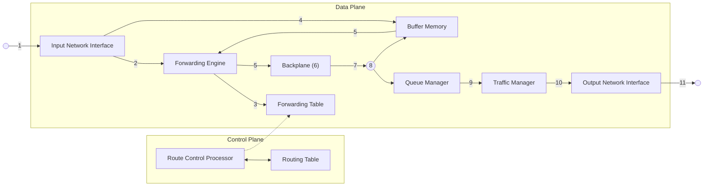

### Switching <!-- omit in toc -->

# Packet Forwarding Devices: Types and Implementations

---

### Table of Contents

* Packet flow in a router
* Fast path vs. slow path
* Memory organization for packet switching
* Hardware-aided switching
* Switch fabric

---

## Packet Flow

#### The packet context

A data structure that essentially serves as a scratch pad for carrying
information between different stages of packet processing inside the router.

* Ingress interface number
* Ingress interface type
* Ingress L2 information
* L3 information
* Next-hop
* Egress L2 information

### Ingress packet processing

1. An IP packet is received at the Input Network Interface (assume it is an
   Ethernet packet). Then the interface:

    1. Interprets the Ethernet header,
    2. Detects frame boundaries,
    3. Identifies the starting point of the IP packet,
    4. The L2 processing logic removes the L2 header and appends it to the
       packet context (i.e., source and destination MAC addresses),
    5. The L2 processing logic takes the payload (the IP packet) and along with
       the packet context sends it to the L3 processing logic,
    6. The L3 processing logic locates the IP header and checks its validity,
    7. The L3 processing logic extracts the relevant IP header information (DA,
       SA, protocol type, DSCP bits for differentiated services, type of load –
       TCP or UDP - , destination and source ports) and stores it in the packet
       context.

2. The packet context is sent to the Forwarding Engine.

3. The Forwarding Engine searches the Forwarding Table to determine the next
   hop. The next hop information contains the egress line card and the outgoing
   port the packet needs to be transferred to. This information is populated in
   the packet context.

4. While the Forwarding Engine is determining the nexthop using the packet
   context, the L3 processing logic sends the IP packet to be stored in the
   Buffer Memory temporarily.

5. When the Forwarding Engine finishes, the packet context is appended to the
   address of the packet in memory and sent to the Backplane Interface.

6. From the packet context, the backplane knows to which line card the packet
   needs to be transferred. It extracts it from memory and together with the
   packet context, sends them to the appropriate egress card.  Priority of the
   packet (as decided by the Forwarding Engine) is taken into account while
   transmitting on the backplane.

### Egress packet processing

7. The backplane interface on the egress line card receives the packet and
   stores it in the line card memory.

8. The received packet context is updated with the new address of the memory
   location and sent to the Queue Manager.
    1. The queue manager examines the packet context to determine the packet
       priority (the priority was determined by the forwarding engine in the
       ingress line card during packet classification).
    2. Next the queue manager inserts the context of the packet in the
       appropriate queue.  Switching 9 Egress Packet Processing (2)
    3. The queue manager implements a scheduling algorithm. The scheduling
       algorithm chooses the next packet to be transmitted. In some instances,
       the queues could be full because of congestion in the network. In order to
       handle such cases, the queue manager implements packet dropping behavior
       to proactively drop packets when the router experiences congestion.

9. Once the packet is scheduled to be transmitted, the Traffic Manager examines
   its context to identify the customer and if there are any transmit rate
   limitations that need to be enforced according to the service contract
   (traffic shaping). If the traffic exceeds any rate limitations, the traffic
   manager delays or drops the packet in order to comply with the agreed rate.

10. Finally, the packet context arrives at the egress network interface. The
    packet is retrieved from memory. L3 processing logic updates its TTL and
    updates the checksum. The L2 processing logic adds the appropriate L2
    headers.

11. The packet is transmitted.

## Packet processing: Fast vs. Slow Path

The tasks performed by a router can be categorized into:

* **Time-critical (fast path)**: deals with the majority of the packets and
  needs to be highly optimized to achieve gigabit/s forwarding rates.
  Implemented in hardware in high performance routers. Can be broadly grouped
  into:
    * Header processing: packet validation, packet lifetime control, TTL and
      checksum calculation.
    * Forwarding: destination address lookup, packet classification for service
      differentiation, packet buffering, queue management and scheduling.

* **Non–time-critical (slow path)**: Management, control and error handling.
  Normally implemented in software (CPU). Examples:
    * Processing of data packets that led to errors in the fast path and
      generation of ICMP packets to inform the originating source of the
      packets
    * Processing of routing protocol keep-alive/update messages from/to
      adjacent neighbors
    * Processing/generation of packets pertaining to management protocols, such
      as SNMP
    * ARP
    * Packet Segmentation
    * IP header options: timestamp, source routing, route record, router alert 

## Memory Organization: Pools and particle buffers

● Significant amount of memory used to queue packets
● Optimization: organize in pools
❖ A pool is a large array of memory blocks of the same size (derived
from the MTU)
● Problem: Packets are normally smaller than the link’s MTU
● Solution: A number of pools of different sizes
● Alternative: Divide memory in small blocks: Particles dividing the
packet in several particles.

Memory Organization: Public vs. Private Buffers
● Problem: If all buffers shared:
❖ One interface can take all the capacity
✔ Starvation for the rest of the interfaces.
● Solution:
❖ Some buffers are assigned for exclusive use of
each interface (private buffers)
❖ The remaining public buffers / system buffers:
Shared among all interfaces

## Switching Hardware

All packet processing can be done in software, but parts of the process can be
realized in hardware to speed up the process, in particular for high
performance routers.

Examples
* Custom ASICs for routers (Cisco, Broadcom, Mellanox,…)
* Network Processors (NP) (Broadcom, Mellanox,…)
* Ternary Content Addressable Memories (TCAMs) /Search Processors (Renesas,
  Broadcom,…)
* FPGAs (Xilinx, Intel,…)

### ASICs

Is a type of System on a Chip (SoC) 

* Higher performance
* Harder to make them programmable
* High development cost (and time)

Switching Hardware: Network processors
● Can we have a technology that :
❖ Has the flexibility of programmable processors ?
❖ Has the high speed of ASICs ?
● Network processor: programmable as a CPU,
performance close to ASIC (due to multiprocessors)
● Network Processor:
❖ Specialized circuitry and micro-engines to perform
all generic packet processing functions.
❖ A major programmable module, usually a tailoredmade RISC CPU.
❖ Real time operating system

Switching Hardware: TCAMs (route lookup)
Priority
encoder
Next-hop
memory
P32
P31
P8
Destination
Address
Next-hop
TCAM RAM
1
2
3
M
● Ups
❖ High capacity: e.g. 128 K entries each 72-bits.
❖ High performance > 100 million lookups per sec.
● Cons
❖ High cost
❖ High power consumption
3
0
0
1
1
1
0
0
3

Switching Hardware: FPGAs
● Field Programmable Gate Arrays
● Have evolved to be large SoC with embedded processors, logic blocks, memories
and interfaces
● Can be used to implement reconfigurable network devices
● Flexibility and performance
● Example NetFPGA: N. Zilberman et al, “NetFPGA SUME: Toward 100 Gbps as
Research Commodity," IEEE Micro, 2014.
http://ieeexplore.ieee.org/xpls/abs_all.jsp?arnumber=6866035

Index
• Packet flow in a router
• Fast path vs. slow path
• Memory organization for packet switching
• Hardware-aided switching
• Switch fabrics
■ Switch fabric design
■ HOL → VOQ problem in input-buffered crossbar switch
fabric
■ Control algorithms

Generic Switch Architecture
Ingress Packet
Processing
Egress Packet
Processing
Ingress Packet
Processing
Egress Packet
Processing
Fabric
Input
Interface
Fabric
Output
Interface
Fabric
Input
Interface
Fabric
Output
Interface
Fabric
Input
Buffers
Fabric
Output
Buffers
Fabric
Input
Buffers
Fabric
Output
Buffers
Switch Fabric
Scheduler
Line card 1
Line card N
Packet
Traffic
Packet
Traffic
Fabric interface chip – segmentation, reassembly, fabric accesss
Switch fabric card

Switching Fabric Design
● It is important to control the switching fabric
❖ Calculate and establish the connections
● Problem: Variable packet sizes
❖ Need to calculate connections taking into account that each
cross-point will be available at a different time (when the
packet finishes transmission through the fabric)
❖ High complexity of control
● Thus: some fabrics have a fixed-size switching unit
❖ Packets are split into chunks or cells.
❖ Decisions are taken at fixed intervals
❖ Much simpler scheduling
❖ But: Additional circuitry to fragment and reassemble packets
(SAR)

Switch Fabrics: Shared Medium (Bus)
• Physical limit of speed of bus (NxR), address filters and output
buffers
■ Address filters and output buffers must operate at NxR (N= number of
ports)
• If bus speed >= NxR => Output queuing: optimal throughput
• No sharing of buffers among line cards
■ more memory required for the same packet loss w.r.t. a shared memory
fabric
• Natural implementation of multicast and broadcast
• Operation:
• Time-sharing of
medium (TDM)
• Each output
monitors address tag
to identify its
packets
1
N
R b/s
1
N

Switch Fabrics: Shared Memory
● Physical limit of access time of RAM (read/write at speed 2N times the speed of ports. i.e. 2NR)
● Processing by central controller at packet rate
• not trivial if the controller has to handle multiple priority classes and complicated packet scheduling
● Sharing of buffers (output buffers)
• Efficient use of memory due to statistical sharing. Minimum memory for a target loss rate.
● Multicast requires extra circuitry (multiple reads, or multiple copies in memory)
● E.g. Catalyst 8510, Juniper M40
• Operation
• Packets or cells stored in
multiple shared memory
banks (possibly
interleaved access)
• Kind of output queuing
approach where all output
buffers belong to the shared
memory pool
• Popular switch architecture
(efficient memory usage with
unbalanced traffic)

Switch Fabrics: Crossbar Switch:
Input-Queued Crossbar Switch (IQ)
● Input buffering
● Ups:
• Crossbar and memory run at line rate
• Highly scalable architecture
● Cons:
❖ Head-of-line (HOL) blocking: 58.6% w/o arbiter with uniform traffic
• Non-blocking switch
• Number of cross points N X N
• Memory grows lineally with N
• E.g. Cisco 12000

Switching Fabric Control:
Head of Line Blocking
● Problem in crossbar switch: Two packets compete for
the same outgoing interface
❖ They block the following queued packets on that interface
(input queuing) 🡪 Head of Line (HOL) blocking
3 1
N 1
...
1 2 3 ... N

Switching Fabric Control:
VOQ (Anderson 1993)
● Solution to avoid HOL Blocking:
❖ Virtual Output Queuing (VOQ): a separate queue for
each outgoing interface at the input buffer
1 2 3 ... N
VOQ
1
VOQ
N
...
VOQ
1
VOQ
N
...

Switch Fabrics: Crossbar Switch II:
Output-Queued Crossbar Switch
● Output Queued
● Ups:
• No Head-of-line (HOL) blocking: 100% performance
• No input traffic scheduling is required !
● Cons:
• Crossbar and memory need to run at RxN (speedup = N)
• Less scalable architecture
• Non-blocking switch
• Number of cross
points N X N
• Memory grows lineally
with N

Combined Input-Output Queued crossbar (CIOQ)
● Why do Input-buffered switch fabrics add delay?
❖ Output contention:
✔ Several inputs need to transmit to the same output.
❖ Input queuing:
✔ HOL blocking: a packet waiting for an output to get free blocks the
packets behind it, even if their output ports are available. -- solvable: VoQ
✔ Queueing: Assumed VoQ..: two packets on the same input go to different
free outputs. One must wait.
● Solutions:
❖ VoQ with appropriate scheduling solves HOL factor
❖ Increase the switch fabric speed to S times faster than the line rate. This is
called “Combined Input-Output Queued” crossbar (*)
✔ Theoretically equal to the number of ports: S=N.
✔ Usually S=2 to 5
❖ Assign priorities to packets.
✔ Packets with higher priority will experience less delay.
(*) A speedup requires buffering at the output 

Switch Fabrics:
Distributed Output-Buffered Switch
● Immediate placement of packets in output buffers
● Ups
• Switch fabric (N-buses), AF and buffers run at line-speed R - no need to speed-up
• Optimal throughput: 100%
• Better latency control (QoS guarantees, switching time does not depend on arbiter algorithms)
● Cons
• Cost: Quadratic N2 growth of buffers
• Modularity: limit to number of ports N
● Lower cost Alternative:
• Knock-out switch: add a concentration stage to access to L< N buffers. L=8 for loss=10-6 and N
large

Conclusions on switch fabric design
● High-end Packet switches (packet/cell)
❖ Initially shared-memory or output-queued (ATM)
❖ Were difficult to scale to high throughputs
✔ Memory access time has not been reduced for the last ten years: real
bottleneck of switches
❖ Conclusion:
✔ DOQ (Distributed output-buffered) provides 100% throughput and
delay guarantees but high memory requirements
✔ Try to emulate DOQ with cheaper approaches:
⮚CIOQ requires some speed-up and two queuings
⮚IQ switches seem to be more scalable as they require fewer buffers, but they
require scheduling to get near 100% of throughput
• So let’s find simple scheduling algorithms…

Switching Fabric Control Algorithms
● Requirements:
❖ Simple to implement
❖ Fast
❖ Fair
❖ Starvation free ( no endless waiting in VOQ )
❖ High throughput
● Algorithms:
❖ Parallel Iterative Matching (PIM)
❖ Round Robin Matching (RRM)
❖ iSLIP

Parallel Iterative Matching (PIM)
● Three steps in one iteration:
1. Request: Each input sends a request to every
output for which it has a queued cell.
2. Grant: If an output receives several requests it
chooses one randomly and notifies each input
whether its request was granted or not.
3. Accept: If an input receives several grants it
chooses one randomly.
● Repeat steps 1-3:
❖ Only with free inputs and outputs !!
❖ When no new matching can be found, the algorithm
stops. 

PIM: Example (Two Iterations)
Step 1: Request Step 2: Grant Step 3: Accept
Free / Unmatched
Iteration 1 Iteration 2

PIM: Discussion
● Several iterations necessary
❖ On average 75% matches per iteration
● Problem:
❖ Generation of random decisions at high speed is
not trivial (three-step handshake)
❖ Probably low fairness. Example:
❖ Output a will grant request of each input with
probability ½
❖ Input 1 will only accept the grants ½ of the times.
❖ So for fully loaded inputs (100 %) the throughput is:
✔ T1,a =1/4; T1,b =3/4; T2,a =3/4
1
2
a
b

PIM: Discussion
P1,a =1/4; P1,b =3/4; P2,a =3/4
1
2
a
b
2 b
1 a
1
1
2
a
b
1
1
2
a
b
1
2
a
b
1/2
1/2
2 b
1
2
a
b
1 a
1/2
1/2

RRM – Round-Robin Matching
• RRM chooses following a round-robin scheme instead of
randomly. Each “selector” keeps a pointer to the highest
priority port, ai (accept pointer) and gj
(grant pointer). Each
iteration has 3 steps, in which the inputs and outputs not
assigned are used.
• The algorithm finishes when in an iteration there are no new
connections.
■ Request: Each input sends a request to every output for which it has a
queued cell.
■ Grant: If an output receives several requests, it chooses the first one
starting by the highest priority element, marked by gj
. The pointer is
updated to the value of the next input to the granted one.
■ Accept: If an input receives several grants, it chooses the first one
starting by the highest priority element, marked by ai
. The pointer is
updated to the value of the next output to the granted one. 

RRM: Example I
Step 1: Request
a1=2
a2=3
a3=3
g1=2
g2=3
g3=3
Step 2: Grant
a1=2
a2=3
a3=3
g1=2←2
g2=2←3
g3=3←3
Step 3: Accept
a1=3←2
a2=1←3
a3=3
g1=2
g2=2
g3=3

RRM: Example II
Step 1: Request
a1=3
a2=1
a3=3
g1=
2
g2=
2
g3=
3
Step 2: Grant
a1=3
a2=1
a3=3
g1=2←
2
g2=3←
2
g3=3←
3
Step 3: Accept
a1=2←
3
a2=3←
1
a3=3
g1=
2
g2=
3
g3=
3

RRM: Starvation
● Problem: RRM is not starvation free
❖ Example:
❖ Assumptions:
✔ There are always cells waiting to be transferred.
✔ The destination is always the same.
● Sequence of grants / accepts
❖ Outputs 1 and 3: always grant input 1
❖ Output 2: always grants input 1 at first (updates pointer g2!)
❖ But: input 1 always ignores this grant (and data never goes to output
2)
Instead it accepts output 1 indefinitely.
❖ Output 2 can grant either input 2 or input 3 only.
❖ Cells from input 1 to output 2 will never be granted.
a1=1
a2=3
a3=3
g1=2
g2=1
g3=2

RRM: Starvation Example I
Step 1 – 1st
Iteration
Step 1: Request Step 2: Grant
Step 3: Accept
a1=1
a2=3
a3=3
g1=
2
g2=
1
g3=
2
a1=1
a2=3
a3=3
g1=2←
2
g2=2←
1
g3=2←
2
a1=2←
1
a2=3
a3=3
g1=
2
g2=
2
g3=
2

RRM: Starvation Example I
1
st Step – 2nd
Iteration
Step 1: Request Step 2: Grant
Step 3: Accept
a1=2
a2=3
a3=3
g1=
2
g2=
2
g3=
2
a1=2
a2=3
a3=3
g1=
2
g2=3←
2
g3=
2
a1=2
a2=3←
3
a3=3
g1=
2
g2=
3
g3=
2
Without assignment

RRM: Starvation Example II
2
nd Step – 1st
Iteration
Step 1: Request Step 2: Grant
Step 3: Accept
a1=2
a2=3
a3=3
g1=
2
g2=
3
g3=
2
a1=2
a2=3
a3=3
g1=2←
2
g2=1←
3
g3=2←
2
a1=1←
2
a2=3
a3=3←
3
g1=
2
g2=
1
g3=
2
a1=1
a2=3
a3=3
g1=
2
g2=
1
g3=
2
Comparison with initial
state: The same!

iSLIP (McKeown 1995)
● gj are updated only if their grants are accepted.
Starvation is avoided since the selected pair is given
the minimum priority. Each iteration has 4 steps, in
which the not assigned inputs and outputs are used.
The algorithm finishes when in an iteration there are no
new connections.
❖ Request: Each input sends a request to every output for which it has a queued
cell.
❖ Grant: If an output receives several requests, it chooses the first one starting
by the element of highest priority, marked by the gj
.
❖ Accept: If an input receives several grants, it accepts the first one starting by
the element of highest priority, marked by ai
. The pointer is updated to the
value of the next output to the accepted one. It is updated only in the first
iteration.
❖ Update: The gj
that have been accepted by an input are updated. The gj are
updated only in the first iteration.

iSLIP: Example
Step 1: Request Step 2: Grant
Step 3+4: Accept+Update
a1=1
a2=3
a3=3
g1=
2
g2=
1
g3=
2
a1=2←
1
a2=3
a3=3
g1=2←
2
g2=
1
g3=
2
a1=1
a2=3
a3=3
g1=
2
g2=
1
g3=
2
1st Step – 1st
Iteration

iSLIP: Example
Step 1: Request Step 2: Grant
Step 3+4: Accept+Update
a1=2
a2=3
a3=3
g1=
2
g2=
1
g3=
2
a1=2
a2=3
a3=3
g1=
2
g2=
1
g3=
2
a1=2
a2=3
a3=3
g1=
2
g2=
1
g3=
2
1st Step – 2nd
Iteration
Without
assignment

iSLIP: Example
(…Further iterations possible)
🡺 Now, the system has not
arrived in the same state!
Step1: Request Step 2: Grant
Step3+4: Accept+Update
a1=2
a2=3
a3=3
g1=
2
g2=
1
g3=
2
a1=3←
2
a2=3
a3=3
g1=
2
g2=2←
1
g3=
2
a1=2
a2=3
a3=3
g1=
2
g2=
1
g3=
2
2nd Step – 1st
Iteration

Peformance Comparison

References
● R. Rojas-Cessa, "Interconnections for Computer Communications
and Packet Networks", ISBN 9781482226966, CRC Press, 2017.
● R. White, V. Bollapragada, and C. Murphy, “Inside Cisco IOS
Software Architecture”. Cisco Press 2000 (Available in the library).
❖ Chapters 2, 3, 5
● H.J. Chao, C.H. Lam, E.Oki, “Broadband Packet Switching
Technologies”, Wiley & Sons, 2001
❖ Chapter 1—3
● H. J. Chao, “Next Generation Routers” in: Proceedings of the
IEEE September 2002. (www.ieee.org)
● F. Baker, “Requirements for IPv4 Routers”, RFC 1812, IETF
(www.ietf.org)
● C. Semeria, “Internet Backbone Routers and Evolving Internet
Design”, Juniper Networks 2000. (www.juniper.net)
● C. Semeria, “Implementing a Flexible Hardware-based router for
the new IP infrastructure”, Juniper Networks 2000.
(www.juniper.net)
